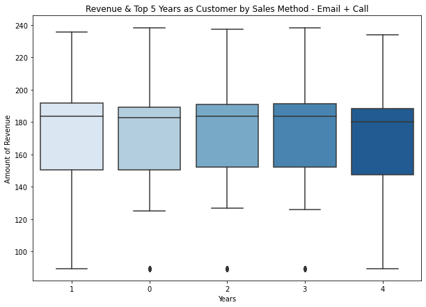

# Pen and Printer's New Product Sales Analysis

## Business Understanding & Problem
Pens and Printers was founded in 1984 and provides high quality office products to large organizations. After launching a line of new products they are searching for insight on the best techniques in selling those products. The company uses three different types of sales methods - email, call, and email + call. Each of these sale methods requires team member to set aside a certain amount time for the customer - an email does not take much time, a call requires arounds thirty minutes per customer, and email and call requires around ten minutes. The goals is to find the best approach for the sales team of Pens and Printers. 

The methods:
<table>
    <tr>
        <th>Sales Method</th>
        <th>Description</th>
    </tr>
        <td>Email</td>
        <td>Customers received an email when the product line was launched, and a further email three weeks later</td>
    <tr>
        <td>Call</td>
        <td>Customers were called by a team member of the sales team</td>
    </tr>
    <tr>
        <td>Email + Call</td>
        <td>Customers were sent the product information email, then called a week later by the sales tema to talk about their needs and how this new product might support their work.</td>
    </tr>
</table>

## Main Findings 
Analyzed 15,000 sales and found that the Email + Call sales method on average brought in more revenue. Also found that with this sales method:
1. More products were bought.
2. Customers visited the site more often within the six months compared to the other methods.
3. The purchase of the new products were in the later weeks following the launch.

## The Notebooks
Only one notebook was used for this analysis the notebook.ipynb. Here all the information resides - the initial exploration, visuals, and comparison between the three sales methods.

## Data Cleaning
The dataset, product_sale.csv, is the primary data source. The dataset contained information pertaining to the revenue, the customer id, the week the sale was made, the method that was used, the location of the customer, the times the customer visited the site in the last six months, how long has the customer been buying the company, and how many products were sold. There were a missing values from the column `revenue` in which I used the median of the value to impute them since the mean is very susceptible to outliers. Also there were values from the `year_as_customer` column in which it did not line up with the current year 2023. These were removed since it was only 2 values. 

## Data Visualizations

### All Sales Method - Number of Site Visits

Can see that in the top 5 number for the site visits all of email is fairly high. The sales method Call is also very consistent throughtout the top 5 visits. With the Email + Call method it tends to vary; however, you see that the highest number 27. 

### All Sales Method - New Products Sold

From this countplot can see that most top 2 amount of products sold are made by the sales method Email. Can also see see that the highest product sold is done with the method Email + Call. 

### Distributions 

<b>All Sales Methods</b>


The distibution for revenue with no filtering is quite interesting, can see that there are some peaks and dips throughout the dataset. There is a bulk of the values between 30 to 70ish, then it dips and picks back up from 80 to 150, and then dips again. As well as another bulk of the values between 170 to 200, and finally a bulk below to 250. Also there is an obvious separation between the sales method with the Email + Call method earning more revenue per customer compared to the others. 

<b>Email</b>

The distribution of revenue for the sales method Email shows that a bulk of those of values are in the early 90s. As show before with the .describe() method most of the values are above the original dataset, product_sales's median. The range is from 80 to a little under 150. The sales method - Email make up the part of from the distrbution of product_sales, it also has 7,465 entries making up 49.77% of the data.

<b>Call</b>

The distribution of revenue for the sales method Call shows that a bulk of the of values are in the range of early 30s to just under 60. There is also some values in the range 60s to but over 70 with no values until a little under 90. As show before with the .describe() method most of the values are under the original dataset, product_sales' median. The range is from early 30s to a little under 90. The sales method - Call make up the part of from the distrbution of product_sales, it also has 4,961 values making up 33.08% of the data.

<b>Email + Call</b>

The distribution of revenue for the sales method Email + Call shows that most of the values are above 100. As shown before with the .describe() method all of the values are above the original dataset, product_sales's median. The range is from the a little under 100 to 240. The sales method makes up the last part of the distribution of product_sales. It has 2,572 instances, making up 17.17% of the dataset. 

### Email + Call - Week

With this violinplot can see that the bulk of the values are towards the higher range of the revenue compared to the other sales method that were in smaller part of the range. Can see that the range differs greatly from the week since the product with launch with week 1 having a range from under a 100 to little under 150, while week 6 has a range of 90 to greater than 250.

### Email + Call - Years as Customer

From this boxplot can see that the range for customers that have been buying products from the company for one and four years have a larger range from under 100 to under 240, compared to the other top 5 years. Most of the values, for all of the top years have most of the values from 150 to 190. The median is quite similar for these years as well - around 180. 

### Email + Call - Number of New Products Sold

From this box plot can see that the more products sold, the more revenue earned per customer which again follows the pattern of the other sales method and makes sense - the more bought, the more earned. All of the values for product sold have a relatively small range and there is not much of an overlap between the values, unlike in the Call method.


### Email + Call - Number of Times the Site was Visited

The customer who visits the site 25 times in 6 months has a larger range of revenue from under 100 to just a little under 240, the other top 5 have a much smaller range at around 120 to under 240. They do have some outliers, which most likely are from the imputation of the median. The median for all of the values in the top 5, have median that are very similar howevr with a around 180. Most of the revenue earned for 29 is 180 to 240, which happens to be the highest value in the top 5. 

## Conclusion
In conclusion, separating the dataset by sales method - Email, Call, Email + Call - has shown that it matters. Email earns an average of \\$96.57 of revenue per customer. Call earns an average of \\$49.13 of revenue per customer. Finally, the sales method - Email + Call earn an average of \\$170.88 of revenue per customer. Therefore, what this tells Pens and Printers is to take more time per customer when selling products i.e. take the time to email and call as a follow up to make the sale which will earn you more revenue per sale. Also found that, with the sale method Email + Call, more products were bought, customers visited a couple of more times than other methods, and the purchase of the products were in the later weeks following the product launch. 

<b>Recommendations</b>
My recommendations for Pens and Printers is to use the sale method - Email and Call for each customer to have more revenue earned per customer. Since on average they earned more than just the Email by \\$74.31 and they earned \\$121.75 more than the Call sales method. Another recommendation I have, is for the sales team to send emails about their product line not just on the day of the launch, and then again three weeks later; but to send them more consistently. For example an email can be sent a couple of days before the launch to create buzz around the product, and sent every week afterwards until the next launch. As was shown in the data the customers who bought their products further from the product launch bought more product per sale and earned more revenue for the company. For the final recommendation, I would recommend launching some sort of loyalty/rewards program for customers that buy a certain amount of products and for how long the customers are with the company. Since the more products bought, the more revenue earned and that for most of the customers they have been with the company for less than 5 years - it would be nice to reward the customers that have been with the company longer as a way of thanks and to keep them shopping at Pens and Printers more consistently.


## Future Investigations 
Analysis on the customers'company such as what industry it is a part of and how long have they been in business - this could lead into some insights on which customers tend to buy more products and which customers to focus on more. Moreover, collecting more in depth-data on the site such as do the customer find it appealing, is it easy to find what they need on the sight, what is it's click through rate, how many impressions does it get? Lastly, gain information of the products itself - what type of products are they, do some sell more than others, do they get good reviews, etc. 

# Repository Structure 
```
├── README.md                            <- The top-level README for reviewers of this project
├── notebook.ipynb                       <- Narrative documentation of analysis and modeling in Jupyter notebook
├── presentation.pdf                     <- PDF version of project presentation
├── data                                 <- Both sourced externally and generated from code
└── images                               <- Both sourced externally and generated from code
```